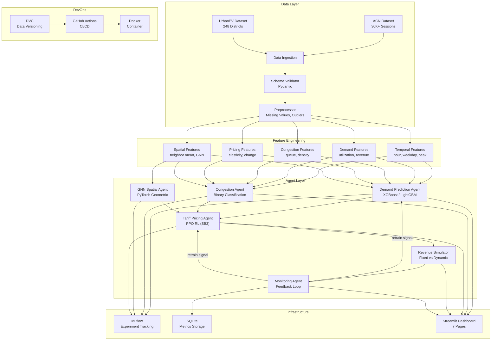
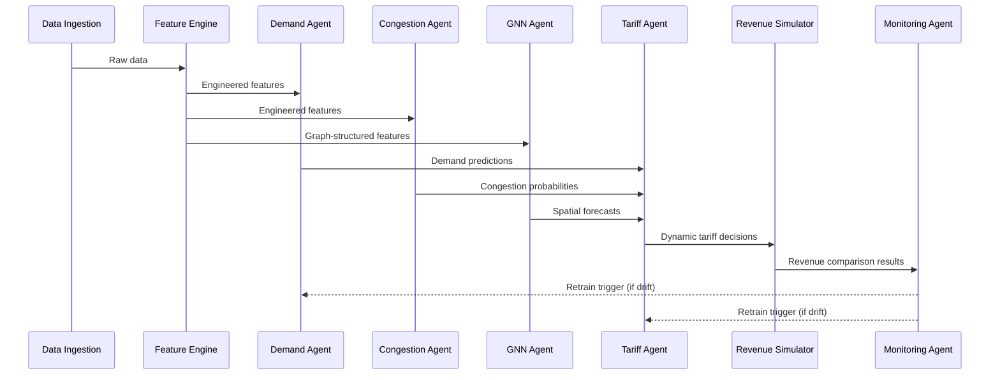

# System Architecture

## High-Level Architecture Diagram

## Component Interaction Flow

## Agent Communication

| Agent | Input | Output | Downstream |
|-------|-------|--------|------------|
| Demand Prediction | Temporal + demand features | Predicted utilization, volume | Tariff Agent |
| Congestion | Temporal + congestion features | Congestion probability | Tariff Agent |
| GNN Spatial | Graph features + adj matrix | Spatial demand forecast | Tariff Agent |
| Tariff Pricing (PPO) | State: [util, demand, price, hour] | Price multiplier action | Revenue Simulator |
| Revenue Simulator | Fixed & dynamic prices | Revenue comparison | Monitoring Agent |
| Monitoring | All agent outputs | Drift alerts, feedback | All agents (retrain) |
